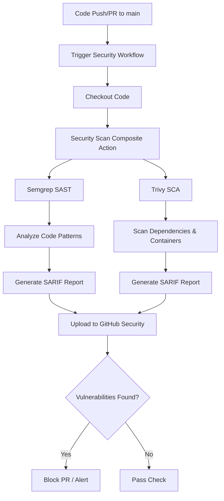
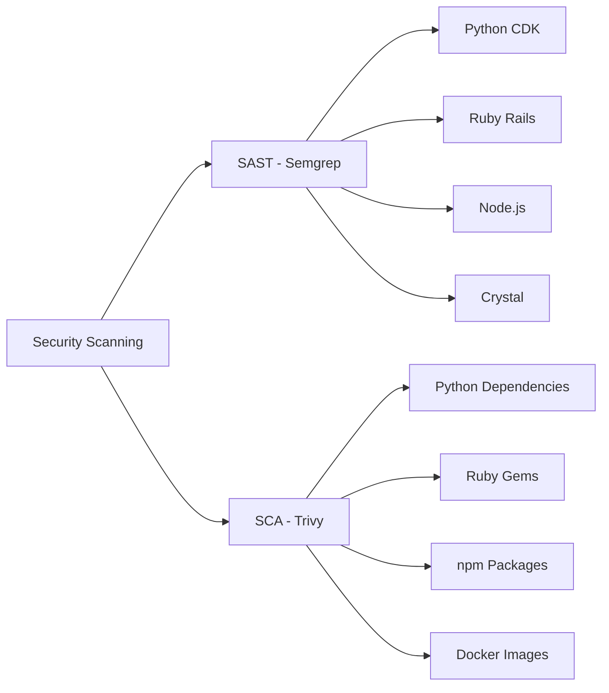

# Security Scanning Workflow

## Overview

Automated security scanning pipeline that performs Static Application Security Testing (SAST) and Software Composition Analysis (SCA) on every code change.

## Purpose

- **Detect vulnerabilities** in application code before deployment
- **Identify security issues** in third-party dependencies
- **Prevent** vulnerable code from reaching production
- **Maintain** security compliance throughout the development lifecycle

## Workflow Architecture



## Scan Coverage



## Tools

### Semgrep (SAST)
- **Purpose**: Detect security vulnerabilities and code quality issues in source code
- **Coverage**: Python, Ruby, JavaScript, and more
- **Rules**: Auto-configured security patterns

### Trivy (SCA)
- **Purpose**: Scan dependencies and container images for known vulnerabilities
- **Coverage**: All package managers (pip, bundler, npm, etc.)
- **Database**: CVE and security advisories

## Trigger Events

| Event | Branch | Description |
|-------|--------|-------------|
| `push` | `main` | Scans on direct commits to main |
| `pull_request` | `main` | Scans before merging to main |

## Results

Security findings are uploaded to **GitHub Security** tab under:
- Code scanning alerts
- Dependabot alerts (if enabled)

## Composite Action

The workflow uses a reusable composite action located at:
```
.github/actions/security-scan/action.yml
```

This promotes:
- **Reusability** across multiple workflows
- **Consistency** in security scanning
- **Maintainability** with centralized configuration

## Permissions

```yaml
contents: read          # Read repository code
security-events: write  # Upload security findings
actions: read          # Access workflow metadata
```

## Best Practices

✅ **Fail fast**: Catch vulnerabilities early in development  
✅ **Automated**: No manual intervention required  
✅ **Comprehensive**: Multi-layer security analysis  
✅ **Transparent**: Results visible in GitHub Security tab  
✅ **Non-blocking for admins**: Admins can bypass if needed
