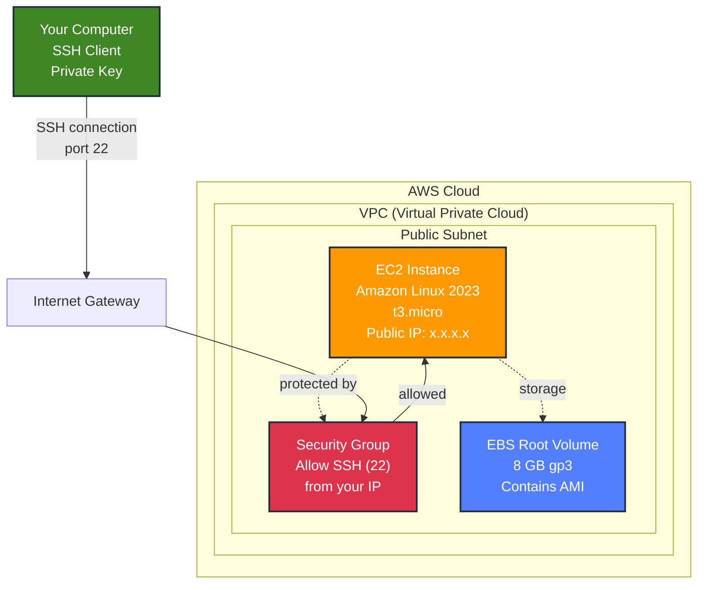
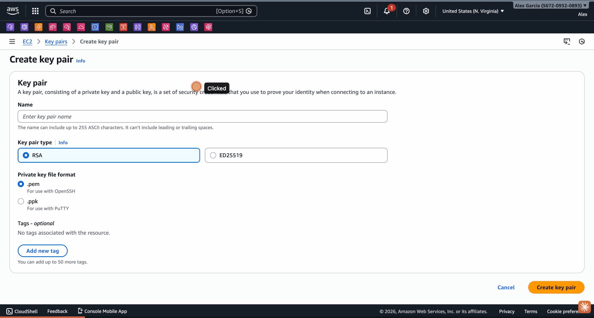
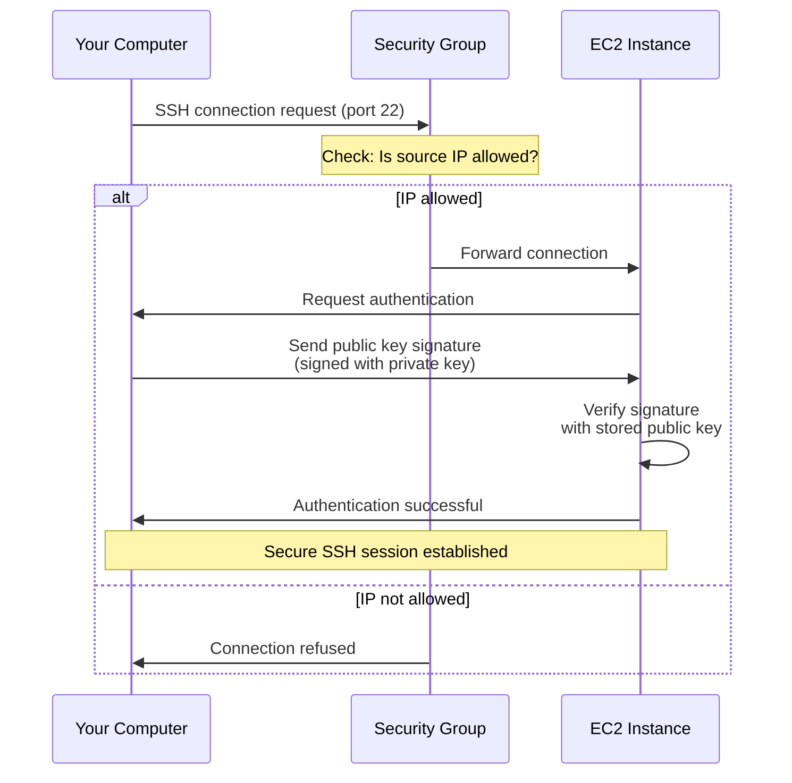
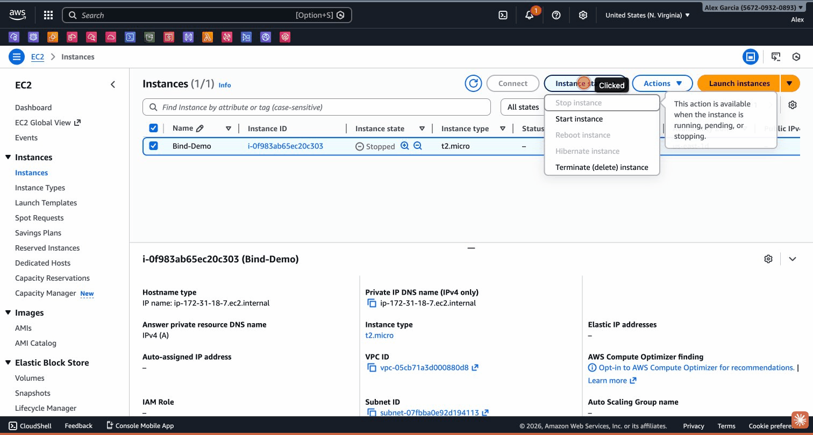

# EC2 Basics Lab


## Overview

This hands-on lab teaches Amazon EC2 fundamentals through practical exercises. Students will learn how to launch an EC2 instance, configure security settings, connect via SSH, and manage instance lifecycle. This lab is based on AWS Tutorial 2 and provides the foundation for all subsequent labs in this course.

## Learning Objectives

- Understand key EC2 components (AMI, instance type, key pair, security group, VPC)
- Create and manage SSH key pairs for secure access
- Launch an EC2 instance with proper configuration
- Configure security groups for SSH access
- Connect to a Linux instance using SSH
- Navigate the EC2 console and view instance details
- Manage instance state (start, stop, terminate)
- Understand EC2 pricing and Free Tier eligibility

## Prerequisites

- AWS Account (Free Tier eligible recommended)
- Basic understanding of cloud computing concepts
- Terminal/command line familiarity
- SSH client installed on your local computer

## What is Amazon EC2?

**Amazon Elastic Compute Cloud (EC2)** provides scalable computing capacity in the AWS Cloud:
- Virtual servers (instances) that you can launch in minutes
- Pay only for what you use (per-second billing)
- Complete control over the operating system and software
- Scalable - easily increase or decrease capacity
- Integrated with other AWS services

## Lab Structure

This lab is divided into 9 tasks that build upon each other. Complete each task before moving to the next one.

---

## Task 1: Familiarize Yourself with Key Components

Before launching an instance, let's understand the key components. Think of an EC2 instance like a rental house:

### AMI (Amazon Machine Image)
**Analogy:** House building materials and amenities

The AMI is a template containing:
- Operating system (Linux, Windows, etc.)
- Pre-installed software
- Configuration settings

**Common AMIs:**
- Amazon Linux 2023 (AWS-optimized, Free Tier eligible)
- Ubuntu Server
- Red Hat Enterprise Linux
- Microsoft Windows Server

### Instance Type
**Analogy:** House size and features

Determines the hardware resources:
- CPU (compute power)
- Memory (RAM)
- Storage capacity
- Network performance

**Example types:**
- `t2.micro` / `t3.micro` - Free Tier eligible, 1 vCPU, 1 GB RAM
- `t2.small` - 1 vCPU, 2 GB RAM
- `m5.large` - 2 vCPU, 8 GB RAM

### Key Pair
**Analogy:** Your front door key

A key pair consists of:
- **Public key** - Stored on the EC2 instance
- **Private key** - Downloaded to your computer (keep it secure!)

Used for secure SSH authentication without passwords.

### Network (VPC and Subnet)
**Analogy:** Neighborhood and street

- **VPC (Virtual Private Cloud)** - Your isolated network in AWS
- **Subnet** - A range of IP addresses within your VPC
- **Public subnet** - Has internet access
- **Private subnet** - No direct internet access

### Security Group
**Analogy:** The gatekeeper

Acts as a virtual firewall:
- Controls inbound traffic (who can connect to your instance)
- Controls outbound traffic (where your instance can connect)
- Rules specify protocols, ports, and source IPs

**Example rule:** Allow SSH (port 22) from your IP address

### EBS Volume
**Analogy:** Storage units

- **Root volume** - Contains the operating system (from AMI)
- **Data volumes** - Additional storage (optional)
- Persistent storage that survives instance stops

### Name Tag
**Analogy:** The house name

- Optional but recommended
- Helps identify instances in the console
- Key: `Name`, Value: your choice

---

## Task 2: Review Technical Diagram

Understanding the architecture helps visualize how components work together:



**Key points:**
1. Your instance runs in a public subnet with internet access
2. Security group filters incoming SSH traffic
3. You authenticate using your private key
4. EBS volume stores the operating system and data

---

## Task 3: Create a Key Pair

A key pair is required for SSH access to your instance.

### Step 3.1: Open EC2 Console

1. Sign in to AWS Management Console
2. Navigate to EC2: https://console.aws.amazon.com/ec2/
3. Select your preferred region (top-right corner)

**Region selection tips:**
- Choose a region close to you for lower latency
- Ensure it's Free Tier eligible
- Common choices: `us-east-1`, `us-west-2`, `eu-west-1`

### Step 3.2: Navigate to Key Pairs

1. In the left navigation pane, under **Network & Security**, click **Key Pairs**
2. Click **Create key pair** button (top-right)


*The Key Pairs page showing existing key pairs and the Create key pair button*

### Step 3.3: Configure Key Pair

Enter the following details:

**Name:** `ec2-lab-key-pair`
- Use a descriptive name
- Can include letters, numbers, hyphens
- Max 255 characters

**Key pair type:** `ED25519`
- More secure than RSA
- Smaller key size
- Supported by Linux instances

**Private key file format:** `.pem`
- Standard format for SSH clients
- Works with OpenSSH on Linux/macOS
- For Windows PuTTY, choose `.ppk`


*Configure the key pair with ED25519 type and .pem format*

### Step 3.4: Download Private Key

1. Click **Create key pair**
2. Your browser automatically downloads `ec2-lab-key-pair.pem`
3. **IMPORTANT:** This is your only chance to download the private key!

### Step 3.5: Secure Your Private Key

**On Linux/macOS:**
```bash
# Move to secure location
mkdir -p ~/.ssh
mv ~/Downloads/ec2-lab-key-pair.pem ~/.ssh/

# Set proper permissions (required for SSH)
chmod 400 ~/.ssh/ec2-lab-key-pair.pem

# Verify permissions
ls -l ~/.ssh/ec2-lab-key-pair.pem
# Should show: -r-------- (read-only for owner)
```

**On Windows:**
```powershell
# Move to secure location
mkdir $HOME\.ssh -Force
Move-Item $HOME\Downloads\ec2-lab-key-pair.pem $HOME\.ssh\

# Set permissions (right-click file → Properties → Security)
# Remove all users except yourself
```

**Security best practices:**
- Never share your private key
- Never commit it to version control
- Store it in a secure location
- Use different keys for different purposes

---

## Task 4: Launch Your Test Instance

Now you'll launch an EC2 instance using the launch wizard.

### Step 4.1: Start Launch Wizard

1. In EC2 console, click **Instances** in left navigation
2. Click **Launch instances** button (orange, top-right)

### Step 4.2: Name Your Instance

**Name and tags section:**
- **Name:** `EC2-Lab-Instance`
- This creates a tag with Key=`Name`, Value=`EC2-Lab-Instance`

**Tagging best practices:**
- Use descriptive names
- For production: add tags like `Environment`, `Project`, `Owner`
- Tags help with organization and cost tracking


*Enter instance name and select Amazon Linux 2023 AMI*

### Step 4.3: Choose AMI

**Application and OS Images (Amazon Machine Image):**
- Select **Amazon Linux 2023 AMI**
- Architecture: **64-bit (x86)**
- Look for **Free tier eligible** label

**Why Amazon Linux 2023?**
- Optimized for AWS
- Long-term support
- Pre-configured with AWS tools
- Regular security updates
- Free Tier eligible

### Step 4.4: Choose Instance Type

**Instance type:**
- Select **t3.micro** (or **t2.micro** if t3 not available)
- Should show **Free tier eligible**

**Instance type details:**
- 1 vCPU
- 1 GB RAM
- Up to 5 Gbps network
- EBS-only storage

**Free Tier limits:**
- 750 hours per month (enough to run 1 instance 24/7)
- Valid for 12 months from account creation (if created before July 15, 2025)
- Or 6 months with credits (if created on/after July 15, 2025)

### Step 4.5: Select Key Pair

**Key pair (login):**
- Select **ec2-lab-key-pair** (created in Task 3)
- If you don't see it, click the refresh icon

**What happens:**
- AWS places the public key on your instance
- You use the private key to authenticate via SSH

### Step 4.6: Configure Network Settings

**Network settings:**

Keep the default settings:
- **VPC:** Default VPC
- **Subnet:** No preference (default subnet)
- **Auto-assign public IP:** Enable

**Firewall (security groups):**
- Select **Create security group**
- **Security group name:** `ec2-lab-sg`
- **Description:** `Allow SSH access for EC2 lab`

**Inbound security group rules:**
- **Type:** SSH
- **Protocol:** TCP
- **Port range:** 22
- **Source type:** My IP
- **Source:** (automatically detected)

**Important:** Using "My IP" restricts SSH access to only your current IP address. This is more secure than "Anywhere" (0.0.0.0/0).


*Configure VPC, subnet, and security group with SSH access*

### Step 4.7: Configure Storage

**Configure storage:**

Keep the default settings:
- **Volume type:** gp3 (General Purpose SSD)
- **Size:** 8 GB
- **Delete on termination:** Yes (checked)

**Storage types:**
- **gp3** - General Purpose SSD (balanced price/performance)
- **gp2** - Previous generation General Purpose SSD
- **io1/io2** - Provisioned IOPS SSD (high performance)
- **st1** - Throughput Optimized HDD (big data)
- **sc1** - Cold HDD (infrequent access)

**Free Tier:**
- 30 GB of EBS storage per month
- gp2 or gp3 volumes


*Configure 8 GB gp3 root volume (Free Tier eligible)*

### Step 4.8: Review and Launch

1. Review the **Summary** panel on the right
2. Verify all settings are correct
3. Click **Launch instance** (orange button, bottom-right)

### Step 4.9: Confirm Launch

You'll see a success message:
- "Successfully initiated launch of instance"
- Instance ID will be shown (e.g., `i-1234567890abcdef0`)
- Click **View all instances** or click the instance ID

---

## Task 5: Find Your Instance

Learn how to locate and identify your instance in the EC2 console.

### Step 5.1: Navigate to Instances

1. In left navigation, click **Instances**
2. You'll see the Instances page with a table of all instances

### Step 5.2: Locate Your Instance

Find your instance by:
- **Name column:** Look for `EC2-Lab-Instance`
- **Instance ID:** The unique identifier (starts with `i-`)
- **Instance state:** Should show `Running` (green dot)


*The Instances page showing your EC2 instance*

**Instance states:**
- **Pending** - Instance is launching
- **Running** - Instance is active and running
- **Stopping** - Instance is shutting down
- **Stopped** - Instance is shut down (not billed for compute)
- **Terminated** - Instance is permanently deleted

### Step 5.3: Wait for Instance to be Ready

- **Instance state:** Wait until it shows `Running`
- **Status check:** Wait until it shows `2/2 checks passed`

This usually takes 1-2 minutes.

**Status checks:**
- **System status check** - AWS infrastructure health
- **Instance status check** - Your instance's software/network

---

## Task 6: View Your Instance Configuration

Explore the instance details to understand its configuration.

### Step 6.1: Open Instance Details

1. Select the checkbox next to your instance name
2. Click **Actions** menu (top-right)
3. Select **View details**

**Alternative:** Click the instance ID link directly

### Step 6.2: Explore Instance Details

The instance details page has several tabs. Explore each one:

**Details tab:**
- **Instance ID** - Unique identifier
- **Instance type** - t3.micro
- **Public IPv4 address** - Used for SSH connection
- **Private IPv4 address** - Internal VPC address
- **AMI ID** - The AMI used to launch
- **AMI name** - Amazon Linux 2023
- **Key pair name** - ec2-lab-key-pair
- **VPC ID** - Your default VPC
- **Subnet ID** - The subnet where instance runs
- **Availability Zone** - Physical data center location

**Security tab:**
- **Security groups** - ec2-lab-sg
- **IAM role** - None (not needed for this lab)

**Networking tab:**
- **Public IPv4 address** - For internet access
- **Public IPv4 DNS** - Hostname for SSH
- **Private IPv4 address** - For VPC communication
- **Elastic IP** - None (not needed for this lab)

**Storage tab:**
- **Root device name** - /dev/xvda
- **Root device type** - EBS
- **Volume ID** - The EBS volume attached
- **Size** - 8 GB
- **Volume type** - gp3

**Tags tab:**
- **Key:** Name, **Value:** EC2-Lab-Instance

**Monitoring tab:**
- CPU utilization
- Network in/out
- Disk read/write
- Status checks


*Instance details page showing configuration information*

### Step 6.3: Note Important Information

Write down these values (you'll need them for SSH):
- **Public IPv4 address:** (e.g., 18.201.118.201)
- **Public IPv4 DNS:** (e.g., ec2-18-201-118-201.eu-west-1.compute.amazonaws.com)

---

## Task 7: Familiarize Yourself with Connection Components

Before connecting, understand the components involved in SSH access.

### Connection Components Analogy

Think of connecting to your instance like going to your house:

**Connection protocol (SSH):** Your mode of transport
- SSH creates a secure, encrypted tunnel
- Protects your data from eavesdropping
- Standard protocol for remote Linux access

**Public DNS/IP:** The house address
- Unique address for your instance
- Enables SSH to find your instance on the internet
- Can use either IP address or DNS name

**Security group:** The gatekeeper
- Filters incoming connections
- Only allows SSH from your IP address
- Blocks all other traffic

**Private key:** Your front door key
- Proves your identity
- Must match the public key on the instance
- Required for authentication

**Instance username:** The resident's name
- Determines which user account you log into
- For Amazon Linux: `ec2-user`
- For Ubuntu: `ubuntu`
- For Red Hat: `ec2-user`

### SSH Connection Flow



---

## Task 8: Connect to Your Instance

Now you'll connect to your instance using SSH.

### Step 8.1: Verify SSH Client

Most computers have SSH pre-installed. Verify:

```bash
ssh -V
```

**Expected output:**
```
OpenSSH_8.9p1, LibreSSL 3.3.6
```

If command not found, you need to install an SSH client (beyond scope of this lab).

### Step 8.2: Get Connection Information

1. In EC2 console, select your instance
2. Click **Connect** button (top-right)
3. Click **SSH client** tab
4. Review the connection instructions


*Click the Connect button to see SSH connection instructions*

### Step 8.3: Connect via SSH

**On Linux/macOS:**

```bash
# Navigate to key location
cd ~/.ssh

# Connect to instance (replace with your public DNS)
ssh -i "ec2-lab-key-pair.pem" ec2-user@ec2-18-201-118-201.eu-west-1.compute.amazonaws.com
```

**Alternative using IP address:**
```bash
ssh -i "ec2-lab-key-pair.pem" ec2-user@18.201.118.201
```

**On Windows (PowerShell):**

```powershell
# Navigate to key location
cd $HOME\.ssh

# Connect to instance
ssh -i "ec2-lab-key-pair.pem" ec2-user@ec2-18-201-118-201.eu-west-1.compute.amazonaws.com
```

### Step 8.4: Accept Host Key

First time connecting, you'll see:

```
The authenticity of host 'ec2-18-201-118-201.eu-west-1.compute.amazonaws.com (18.201.118.201)' can't be established.
ED25519 key fingerprint is SHA256:examplehxj9aOr1MogvKOoMNskVVIRBQBoq0example.
This key is not known by any other names.
Are you sure you want to continue connecting (yes/no/[fingerprint])?
```

Type `yes` and press Enter.

**What's happening:**
- SSH is verifying the instance's identity
- The fingerprint is stored in `~/.ssh/known_hosts`
- Future connections won't ask again

### Step 8.5: Successful Connection

You'll see the Amazon Linux welcome message:

```
   ,     #_
   ~\_  ####_        Amazon Linux 2023
  ~~  \_#####\
  ~~     \###|
  ~~       \#/ ___   https://aws.amazon.com/linux/amazon-linux-2023
   ~~       V~' '->
    ~~~         /
      ~~._.   _/
         _/ _/
       _/m/'

[ec2-user@ip-172-31-32-10 ~]$
```

**Congratulations!** You're now connected to your EC2 instance!

### Step 8.6: Explore Your Instance

Try these commands:

```bash
# Check operating system
cat /etc/os-release

# Check system resources
free -h
df -h

# Check CPU info
lscpu

# Check network configuration
ip addr show

# Check running processes
ps aux

# Check system uptime
uptime

# Check who's logged in
who

# View system logs
sudo journalctl -n 20
```

### Step 8.7: Install Software (Optional)

```bash
# Update package manager
sudo dnf update -y

# Install useful tools
sudo dnf install -y htop tree wget curl

# Check installed packages
dnf list installed | head -20
```

### Step 8.8: Disconnect

To exit the SSH session:

```bash
exit
```

Or press `Ctrl+D`.

---

## Task 9: Stop Your Instance

To avoid charges, stop your instance when not in use.

### Understanding Instance States

**Running:**
- Instance is active
- You're charged for compute time
- Can connect via SSH

**Stopped:**
- Instance is shut down
- No compute charges
- Still charged for EBS storage (minimal)
- Can restart anytime
- Public IP may change on restart

**Terminated:**
- Instance is permanently deleted
- All data lost (unless EBS volumes set to persist)
- Cannot be restarted
- No charges

### Step 9.1: Stop Instance

1. In EC2 console, go to **Instances**
2. Select your instance checkbox
3. Click **Instance state** menu (top-right)
4. Select **Stop instance**
5. Click **Stop** in confirmation dialog


*The Instance state dropdown showing Stop, Start, Reboot, and Terminate options*

### Step 9.2: Monitor State Change

Watch the **Instance state** column:
- **Stopping** - Instance is shutting down
- **Stopped** - Instance is fully stopped

This takes about 30-60 seconds.

### Step 9.3: Verify No Charges

When stopped:
- ✅ No compute charges
- ⚠️ Small EBS storage charge (~$0.80/month for 8 GB)
- ✅ Still within Free Tier limits (30 GB/month)

### Step 9.4: Restart Instance (Optional)

To restart later:
1. Select your instance
2. Click **Instance state** → **Start instance**
3. Wait for state to become **Running**
4. **Note:** Public IP address may change!

### Step 9.5: Terminate Instance (When Done)

When you're completely done with the lab:

1. Select your instance
2. Click **Instance state** → **Terminate instance**
3. Click **Terminate** in confirmation dialog

**Warning:** This permanently deletes the instance and all data!

---

## Troubleshooting

### Cannot connect via SSH

**Error:** `Connection timed out`

**Solutions:**
1. Check security group allows SSH from your IP
2. Verify instance is in **Running** state
3. Verify you're using the correct public IP/DNS
4. Check your internet connection
5. Try using IP address instead of DNS name

**Error:** `Permission denied (publickey)`

**Solutions:**
1. Verify you're using the correct private key file
2. Check key file permissions: `chmod 400 ec2-lab-key-pair.pem`
3. Verify you're using correct username (`ec2-user` for Amazon Linux)
4. Ensure you selected the correct key pair when launching

**Error:** `WARNING: UNPROTECTED PRIVATE KEY FILE!`

**Solution:**
```bash
chmod 400 ~/.ssh/ec2-lab-key-pair.pem
```

### Instance won't start

**Solutions:**
1. Check AWS Service Health Dashboard
2. Try stopping and starting again
3. Check if you've reached instance limits
4. Verify Free Tier eligibility

### Lost private key

**Solution:**
- You cannot recover a lost private key
- You must create a new key pair
- Launch a new instance with the new key pair
- Or use AWS Systems Manager Session Manager (advanced)

### IP address changed after restart

**This is normal behavior:**
- Public IP addresses are dynamic by default
- They change when you stop/start an instance
- Solutions:
  - Use Elastic IP (static IP, small charge when not attached)
  - Use public DNS name (updates automatically)

---

## Cost Management

### Free Tier Limits

**EC2 Free Tier (12 months or 6 months with credits):**
- 750 hours/month of t2.micro or t3.micro
- 30 GB of EBS storage
- 2 million I/O operations
- 1 GB of snapshots

**How to stay within Free Tier:**
- Use only t2.micro or t3.micro instances
- Run only 1 instance at a time
- Stop instances when not in use
- Delete unused EBS volumes and snapshots

### Monitoring Costs

**Check your usage:**
1. Go to AWS Billing Dashboard
2. Click **Free Tier** in left navigation
3. View current usage vs. limits

**Set up billing alerts:**
1. Go to AWS Billing Dashboard
2. Click **Billing preferences**
3. Enable **Receive Free Tier Usage Alerts**
4. Enter your email address

---

## Key Concepts Summary

1. **EC2** provides virtual servers (instances) in the AWS Cloud
2. **AMI** is a template containing the OS and software
3. **Instance type** determines CPU, memory, and network capacity
4. **Key pair** enables secure SSH authentication
5. **Security group** acts as a firewall controlling traffic
6. **VPC and subnet** provide network isolation
7. **EBS volume** provides persistent storage
8. **SSH** is the protocol for secure remote access
9. **Stopping** an instance saves costs while preserving configuration
10. **Terminating** permanently deletes an instance

---

## Next Steps

Now that you understand EC2 basics, you're ready for more advanced labs:

1. **[02 HAProxy Load Balancing Demo](../02%20HAProxy%20Load%20Balancing%20Demo)** - Learn load balancing algorithms
2. **[03 DNS and BIND Lab](../03%20DNS%20and%20BIND%20Lab)** - Configure DNS servers
3. **[01 Horizontal Scalability Demo](../01%20Horizontal%20Scalability%20Demo)** - Deploy autoscaling applications

**Additional learning:**
- AWS EC2 User Guide: https://docs.aws.amazon.com/ec2/
- AWS Free Tier: https://aws.amazon.com/free/
- AWS Well-Architected Framework: https://aws.amazon.com/architecture/well-architected/

---

## Additional Resources

- [AWS EC2 Documentation](https://docs.aws.amazon.com/ec2/)
- [AWS Free Tier](https://aws.amazon.com/free/)
- [EC2 Instance Types](https://aws.amazon.com/ec2/instance-types/)
- [AWS Pricing Calculator](https://calculator.aws/)
- [SSH Connection Prerequisites](https://docs.aws.amazon.com/AWSEC2/latest/UserGuide/connection-prereqs.html)

## Author

Created by [Alex Garcia](https://github.com/gamaware)

- [LinkedIn Profile](https://www.linkedin.com/in/gamaware/)
- [Personal Website](https://alexgarcia.info/)

## License

This project is licensed under the MIT License - see the [LICENSE](../LICENSE) file for details.
