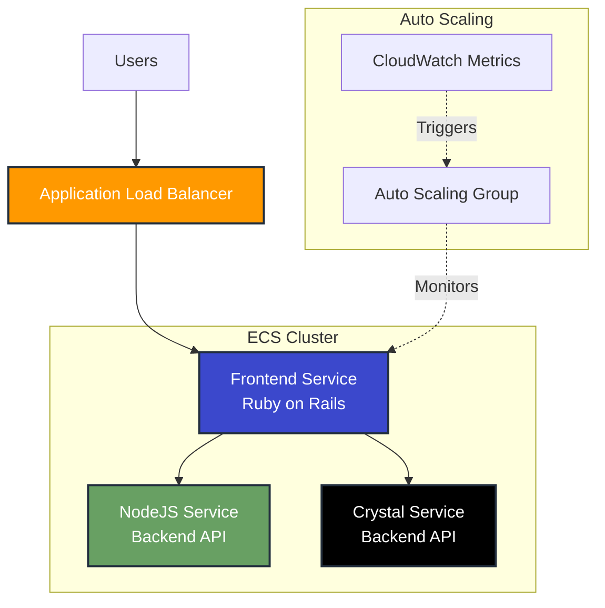

# Horizontal Scalability Demo


## Overview

This hands-on workshop demonstrates horizontal scaling using AWS ECS Fargate, Application Load Balancer, and autoscaling. Students will deploy a microservices architecture, configure load balancing, implement CPU-based autoscaling, and observe scaling behavior under load.

## Learning Objectives

- Deploy containerized microservices using AWS CDK (Infrastructure as Code)
- Configure Application Load Balancers for traffic distribution
- Implement CPU-based autoscaling policies
- Monitor and observe scaling behavior with CloudWatch
- Perform load testing to trigger autoscaling events
- Understand horizontal scaling patterns and best practices

## Architecture



## Prerequisites

- AWS Account with appropriate permissions
- AWS CLI configured with credentials
- Python 3.9+
- Node.js 14+
- Docker (optional, for local testing)
- Basic understanding of containers and AWS services

## Workshop Structure

This workshop is organized into phases:

1. **Prerequisites and Setup** - Environment configuration
2. **Platform Infrastructure** - VPC, ECS Cluster, networking
3. **Frontend Deployment** - Deploy the main application
4. **Backend Services** - Deploy supporting microservices
5. **Manual Scaling** - Scale services manually
6. **Autoscaling** - Configure and test automatic scaling
7. **Load Testing** - Trigger scaling events
8. **Cleanup** - Remove all resources

## Quick Start

### Option 1: Automated Setup (Recommended for Quick Demo)

```bash
# Clone the repository
git clone https://github.com/gamaware/system-design-course.git
cd "system-design-course/01 Horizontal Scalability Demo"

# Run quick start script
chmod +x quick-start.sh
./quick-start.sh
```

### Option 2: Step-by-Step Workshop (Recommended for Learning)

Follow the detailed guides:
- [STEP_BY_STEP_WORKSHOP.md](./STEP_BY_STEP_WORKSHOP.md) - Complete walkthrough
- [COMPLETE_WORKSHOP_GUIDE.md](./COMPLETE_WORKSHOP_GUIDE.md) - Comprehensive guide
- [WORKSHOP_GUIDE.md](./WORKSHOP_GUIDE.md) - Original workshop guide

## Services Architecture

### Frontend Service (Ruby on Rails)
- **Purpose**: Main web interface
- **Technology**: Ruby on Rails
- **Port**: 3000
- **Scaling**: Horizontal with ALB

### NodeJS Service
- **Purpose**: Backend API service
- **Technology**: Node.js/Express
- **Port**: 3000
- **Features**: Service discovery integration

### Crystal Service
- **Purpose**: High-performance backend API
- **Technology**: Crystal language
- **Port**: 3000
- **Features**: Low latency responses

## Key Features

### Infrastructure as Code (AWS CDK)
- Python-based CDK stacks
- Reproducible deployments
- Version-controlled infrastructure
- Easy teardown and recreation

### Horizontal Scaling
- ECS Fargate for serverless containers
- Application Load Balancer for traffic distribution
- Target tracking autoscaling policies
- CloudWatch metrics integration

### Observability
- CloudWatch Logs for application logs
- CloudWatch Metrics for performance monitoring
- Service discovery for microservices communication
- Real-time scaling visualization

## Workshop Phases

### Phase 1: Prerequisites and Setup

```bash
# Activate workshop environment
source activate.sh

# Configure AWS credentials
aws configure

# Bootstrap CDK
cdk bootstrap
```

### Phase 2: Deploy Platform Infrastructure

```bash
cd ecsdemo-platform/cdk
cdk deploy --require-approval never
```

**Creates:**
- VPC with public/private subnets
- ECS Cluster
- Security Groups
- Service Discovery namespace
- Bastion host (optional)

### Phase 3: Deploy Frontend Service

```bash
cd ../../ecsdemo-frontend/cdk
cdk deploy --require-approval never
```

**Creates:**
- Application Load Balancer
- ECS Service with Fargate tasks
- Target Group
- CloudWatch Log Group

### Phase 4: Deploy Backend Services

```bash
# Deploy NodeJS service
cd ../../ecsdemo-nodejs/cdk
cdk deploy --require-approval never

# Deploy Crystal service
cd ../../ecsdemo-crystal/cdk
cdk deploy --require-approval never
```

### Phase 5: Manual Scaling

```bash
# Scale frontend to 3 tasks
aws ecs update-service \
  --cluster container-demo \
  --service ecsdemo-frontend \
  --desired-count 3

# Verify scaling
aws ecs describe-services \
  --cluster container-demo \
  --services ecsdemo-frontend \
  --query 'services[0].desiredCount'
```

### Phase 6: Configure Autoscaling

```bash
# Register scalable target
aws application-autoscaling register-scalable-target \
  --service-namespace ecs \
  --scalable-dimension ecs:service:DesiredCount \
  --resource-id service/container-demo/ecsdemo-frontend \
  --min-capacity 1 \
  --max-capacity 10

# Create scaling policy
aws application-autoscaling put-scaling-policy \
  --service-namespace ecs \
  --scalable-dimension ecs:service:DesiredCount \
  --resource-id service/container-demo/ecsdemo-frontend \
  --policy-name cpu-scaling-policy \
  --policy-type TargetTrackingScaling \
  --target-tracking-scaling-policy-configuration file://scaling-policy.json
```

### Phase 7: Load Testing

```bash
# Get ALB URL
ALB_URL=$(aws elbv2 describe-load-balancers \
  --query 'LoadBalancers[0].DNSName' \
  --output text)

# Run load test with siege
siege -c 200 -t 2m http://$ALB_URL

# Monitor scaling in real-time
watch -n 5 'aws ecs describe-services \
  --cluster container-demo \
  --services ecsdemo-frontend \
  --query "services[0].desiredCount"'
```

## Monitoring and Observability

### CloudWatch Metrics

```bash
# View CPU utilization
aws cloudwatch get-metric-statistics \
  --namespace AWS/ECS \
  --metric-name CPUUtilization \
  --dimensions Name=ServiceName,Value=ecsdemo-frontend \
  --start-time $(date -u -d '10 minutes ago' +%Y-%m-%dT%H:%M:%S) \
  --end-time $(date -u +%Y-%m-%dT%H:%M:%S) \
  --period 60 \
  --statistics Average
```

### CloudWatch Logs

```bash
# Stream logs from frontend service
awslogs get /ecs/ecsdemo-frontend --watch
```

### Service Health

```bash
# Check service status
aws ecs describe-services \
  --cluster container-demo \
  --services ecsdemo-frontend ecsdemo-nodejs ecsdemo-crystal
```

## Scaling Policies

### CPU-Based Scaling

**Target**: 75% CPU utilization
**Scale Out**: Add tasks when CPU > 75%
**Scale In**: Remove tasks when CPU < 75%
**Cooldown**: 60 seconds

### Memory-Based Scaling (Optional)

**Target**: 80% memory utilization
**Scale Out**: Add tasks when memory > 80%
**Scale In**: Remove tasks when memory < 80%

## Troubleshooting

### Services Not Starting

```bash
# Check service events
aws ecs describe-services \
  --cluster container-demo \
  --services ecsdemo-frontend \
  --query 'services[0].events[0:5]'

# Check task status
aws ecs list-tasks \
  --cluster container-demo \
  --service-name ecsdemo-frontend

# View task logs
aws logs tail /ecs/ecsdemo-frontend --follow
```

### Load Balancer Issues

```bash
# Check target health
aws elbv2 describe-target-health \
  --target-group-arn <target-group-arn>

# Check ALB listeners
aws elbv2 describe-listeners \
  --load-balancer-arn <alb-arn>
```

### Autoscaling Not Working

```bash
# Check scaling policies
aws application-autoscaling describe-scaling-policies \
  --service-namespace ecs

# Check scaling activities
aws application-autoscaling describe-scaling-activities \
  --service-namespace ecs \
  --resource-id service/container-demo/ecsdemo-frontend
```

## Cleanup

### Option 1: Automated Cleanup

```bash
# Run cleanup script
./cleanup.sh
```

### Option 2: Manual Cleanup

```bash
# Delete services in reverse order
cd ecsdemo-crystal/cdk && cdk destroy --force
cd ../../ecsdemo-nodejs/cdk && cdk destroy --force
cd ../../ecsdemo-frontend/cdk && cdk destroy --force
cd ../../ecsdemo-platform/cdk && cdk destroy --force

# Deactivate environment
source deactivate.sh
```

## Cost Considerations

**Estimated costs for running this workshop:**
- ECS Fargate tasks: ~$0.04/hour per task
- Application Load Balancer: ~$0.025/hour
- NAT Gateway: ~$0.045/hour
- Data transfer: Minimal for testing

**Total estimated cost**: ~$0.50-$1.00 per hour

**💡 Tip**: Always run cleanup after completing the workshop to avoid unnecessary charges.

## Key Concepts

### Horizontal Scaling
- Adding more instances of the same service
- Distributes load across multiple containers
- Increases availability and fault tolerance
- Scales based on demand

### Vertical Scaling (Not Covered)
- Increasing resources (CPU/memory) of existing instances
- Limited by instance size constraints
- Requires downtime for changes

### Autoscaling Strategies
- **Target Tracking**: Maintain specific metric target
- **Step Scaling**: Scale based on metric thresholds
- **Scheduled Scaling**: Scale at specific times

### Load Balancing
- **Round Robin**: Distribute requests evenly
- **Least Outstanding Requests**: Send to least busy target
- **Health Checks**: Remove unhealthy targets automatically

## Additional Resources

- [AWS ECS Documentation](https://docs.aws.amazon.com/ecs/)
- [AWS CDK Documentation](https://docs.aws.amazon.com/cdk/)
- [Application Load Balancer Guide](https://docs.aws.amazon.com/elasticloadbalancing/latest/application/)
- [ECS Autoscaling](https://docs.aws.amazon.com/AmazonECS/latest/developerguide/service-auto-scaling.html)

## Workshop Guides

- [STEP_BY_STEP_WORKSHOP.md](./STEP_BY_STEP_WORKSHOP.md) - Detailed step-by-step instructions
- [COMPLETE_WORKSHOP_GUIDE.md](./COMPLETE_WORKSHOP_GUIDE.md) - Comprehensive guide with explanations
- [WORKSHOP_GUIDE.md](./WORKSHOP_GUIDE.md) - Original workshop documentation

## Author

Created by [Alex Garcia](https://github.com/gamaware)

- [LinkedIn Profile](https://www.linkedin.com/in/gamaware/)
- [Personal Website](https://alexgarcia.info/)

## License

This project is licensed under the MIT License - see the [LICENSE](../LICENSE) file for details.
